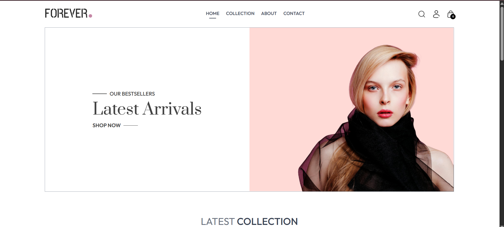
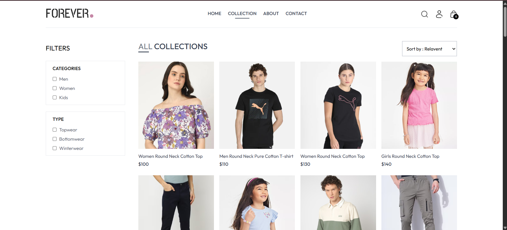
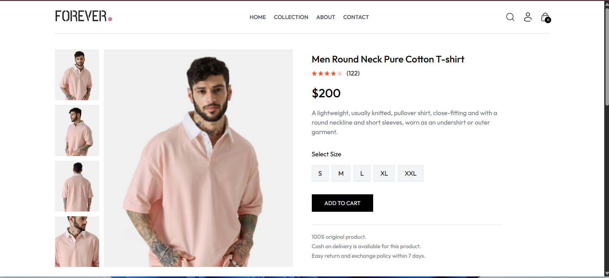
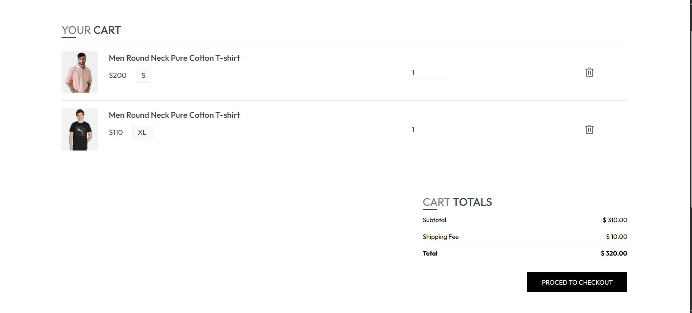
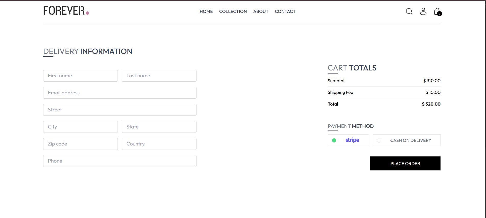
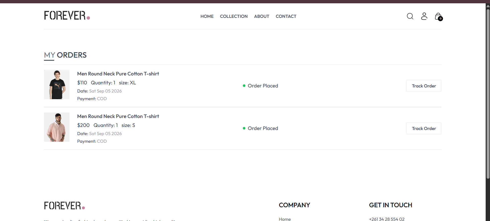
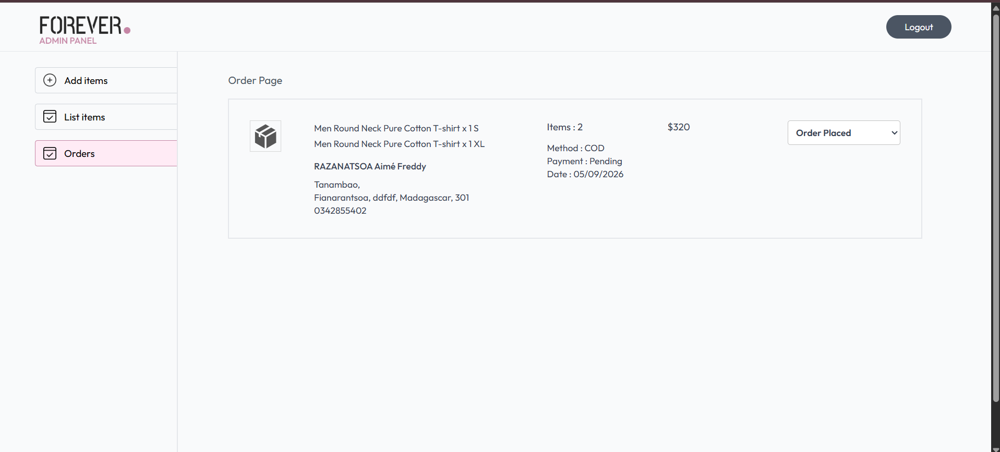

# 🛍️ Ecommerce Clothing

A full-stack fashion e-commerce application built with **React, Node.js, Express, MongoDB, Stripe, and Cloudinary**.

The application provides a complete online shopping experience for customers and includes a dedicated admin dashboard for managing products and orders.

---

## 🚀 Overview

**Ecommerce Clothing** is a full-stack web application designed to simulate a modern online fashion store.

Customers can browse products, filter collections, manage their shopping cart, place orders, choose a payment method, and track their orders.

The project also includes a separate **Admin Dashboard** where administrators can manage products, upload images, view customer orders, and update order statuses.

---

## ✨ Features

### 👤 Customer Application

- User registration
- User login and authentication
- JWT-based authentication
- Browse available products
- Search products
- Filter products by category
- Filter products by subcategory
- Sort products
- View product details
- Select product sizes
- Add products to cart
- Update product quantities
- Remove products from cart
- Persistent user cart
- Checkout form with delivery information
- Cash on Delivery payment
- Stripe Checkout integration
- View personal orders
- Track order status
- Responsive interface

### 🛠️ Admin Dashboard

- Secure admin authentication
- Add new products
- Upload multiple product images
- Store product images on Cloudinary
- View all products
- Remove products
- View all customer orders
- View customer delivery information
- View payment method
- View payment status
- View order date and amount
- Update order status

---

## 🧰 Tech Stack

### Frontend

- React
- Vite
- React Router
- Tailwind CSS
- Axios
- React Toastify

### Admin Dashboard

- React
- Vite
- React Router
- Tailwind CSS
- Axios
- React Toastify

### Backend

- Node.js
- Express.js
- MongoDB
- Mongoose
- JSON Web Token (JWT)
- bcrypt
- Multer
- Validator

### External Services

- **Cloudinary** — product image storage
- **Stripe** — online payment processing
- **MongoDB Atlas** — cloud database

---

# 📸 Screenshots

## Customer Application

### Home Page



---

### Product Collection



---

### Product Details



---

### Shopping Cart



---

### Checkout



---

### My Orders



---

## Admin Dashboard

### Product Management


---

### Order Management



---

## 📁 Project Structure

```text
ecommerce-clothing/
│
├── admin/
│   ├── src/
│   │   ├── assets/
│   │   ├── components/
│   │   └── pages/
│   │
│   ├── .env.example
│   ├── package.json
│   └── vite.config.js
│
├── backend/
│   ├── config/
│   ├── controllers/
│   ├── middleware/
│   ├── models/
│   ├── routes/
│   │
│   ├── .env.example
│   ├── package.json
│   └── server.js
│
├── frontend/
│   ├── src/
│   │   ├── assets/
│   │   ├── components/
│   │   ├── context/
│   │   └── pages/
│   │
│   ├── .env.example
│   ├── package.json
│   └── vite.config.js
│
├── docs/
│   └── screenshots/
│       ├── home.png
│       ├── collection.png
│       ├── product.png
│       ├── cart.png
│       ├── checkout.png
│       ├── orders.png
│       ├── admin-products.png
│       └── admin-orders.png
│
├── .gitignore
└── README.md
```

---

# ⚙️ Getting Started

Follow the instructions below to run the project locally.

## Prerequisites

Make sure you have the following installed:

- Node.js
- npm
- Git

You will also need accounts for:

- MongoDB Atlas
- Cloudinary
- Stripe

---

# 📥 Installation

## 1. Clone the repository

```bash
git clone https://github.com/freddy810/ecommerce-clothing.git
```

Move into the project directory:

```bash
cd ecommerce-clothing
```

---

## 2. Install Backend Dependencies

```bash
cd backend
npm install
```

---

## 3. Install Frontend Dependencies

```bash
cd ../frontend
npm install
```

---

## 4. Install Admin Dependencies

```bash
cd ../admin
npm install
```

---

# 🔐 Environment Variables

Real `.env` files are intentionally excluded from this repository for security reasons.

The repository contains `.env.example` files showing the variables required to run the application.

Create your own `.env` files based on these examples.

---

## Backend Environment Variables

Create:

```text
backend/.env
```

Example:

```env
MONGODB_URL=your_mongodb_connection_string

CLOUDINARY_NAME=your_cloudinary_cloud_name
CLOUDINARY_API_KEY=your_cloudinary_api_key
CLOUDINARY_SECRET_KEY=your_cloudinary_secret_key

JWT_SECRET=your_jwt_secret

ADMIN_EMAIL=your_admin_email
ADMIN_PASSWORD=your_admin_password

STRIPE_SECRET_KEY=your_stripe_secret_key

PORT=4000
```

---

## Frontend Environment Variables

Create:

```text
frontend/.env
```

Example:

```env
VITE_BACKEND_URL=http://localhost:4000
```

---

## Admin Environment Variables

Create:

```text
admin/.env
```

Example:

```env
VITE_BACKEND_URL=http://localhost:4000
```

> ⚠️ Never commit real passwords, API keys, database credentials, or `.env` files to GitHub.

---

# ▶️ Running the Application

You will normally need three terminals.

## 1. Start the Backend

```bash
cd backend
npm run server
```

The backend runs by default on:

```text
http://localhost:4000
```

---

## 2. Start the Customer Frontend

Open another terminal:

```bash
cd frontend
npm run dev
```

Vite will display the local development URL in your terminal.

---

## 3. Start the Admin Dashboard

Open another terminal:

```bash
cd admin
npm run dev
```

Vite will display the admin dashboard URL in your terminal.

---

# 🔌 API Overview

The backend provides REST API endpoints for the main application features.

```text
/api/user
/api/product
/api/cart
/api/order
```

### User API

Handles:

- User registration
- User login
- Admin login
- Authentication

### Product API

Handles:

- Product creation
- Product listing
- Product removal
- Product information

### Cart API

Handles:

- Adding products to cart
- Updating cart quantities
- Retrieving user cart data

### Order API

Handles:

- Cash on Delivery orders
- Stripe orders
- User order history
- Admin order management
- Order status updates

---

# 💳 Payment Methods

## Cash on Delivery

Customers can place an order without making an online payment.

The order is stored with the payment status marked as pending.

---

## Stripe

Stripe Checkout is integrated into the application for online payment processing.

The customer is redirected to Stripe Checkout to complete the payment.

After the payment process, the application redirects the customer back to the website and processes the order result.

---

# ☁️ Image Management

Product images are managed using **Cloudinary**.

The admin dashboard allows multiple images to be selected when creating a product.

The backend uses **Multer** to process uploaded files and sends them to Cloudinary for storage.

Cloudinary URLs are then saved with the product information in MongoDB.

---

# 🔑 Authentication

The application uses **JSON Web Tokens (JWT)** for authentication.

Authentication middleware protects private functionality such as:

- Shopping cart operations
- Customer orders
- Checkout
- Admin product management
- Admin order management

Passwords are securely processed using **bcrypt**.

---

# 🗄️ Database

The application uses **MongoDB** with **Mongoose**.

The main database models include:

- Users
- Products
- Orders

MongoDB Atlas can be used to host the database online.

---

# 🔒 Security

Sensitive information is stored using environment variables.

Files such as:

```text
admin/.env
backend/.env
frontend/.env
```

are excluded from Git tracking using `.gitignore`.

Only `.env.example` files are included in the repository.

Never expose:

- MongoDB credentials
- JWT secrets
- Cloudinary secret keys
- Stripe secret keys
- Admin passwords

---

# 🛣️ Future Improvements

Possible future improvements include:

- Product editing from the admin dashboard
- Wishlist functionality
- Product reviews and ratings
- Inventory and stock management
- Email order confirmation
- Password reset functionality
- User profile management
- Product pagination
- Automated testing
- Stripe webhook verification
- Complete Razorpay integration
- Application deployment
- Improved admin analytics dashboard

---

# 🎯 Project Purpose

This project was created to practice and demonstrate full-stack web development concepts including:

- Frontend development with React
- REST API development
- Authentication and authorization
- Database management
- File uploads
- Cloud image storage
- Online payment integration
- Shopping cart management
- Admin dashboard development
- Full-stack application architecture

---

# 🤝 Contributing

Contributions, suggestions, and improvements are welcome.

If you would like to contribute:

1. Fork the repository
2. Create a new branch

```bash
git checkout -b feature/your-feature-name
```

3. Make your changes
4. Commit your changes

```bash
git commit -m "feat: add new feature"
```

5. Push your branch

```bash
git push origin feature/your-feature-name
```

6. Open a Pull Request

---

# 👨‍💻 Author

**Freddy**

GitHub: [@freddy810](https://github.com/freddy810)

Repository:

[github.com/freddy810/ecommerce-clothing](https://github.com/freddy810/ecommerce-clothing)

---

# 📄 License

This project is currently intended for educational and portfolio purposes.

---

⭐ If you found this project useful or interesting, feel free to give the repository a star!